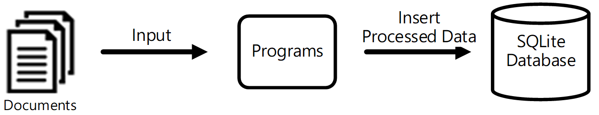
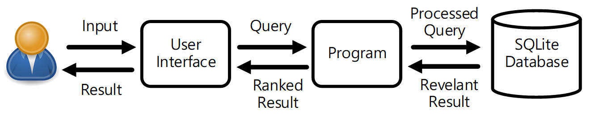

# Simple-Search-Engine
A simple search engine for the given documents.

## Getting Started

### Prerequisites

Install the Eclipse IDE.

### Installing

Execute Eclipse IDE and import the project

## System Architecture

1. Building the Database

Documents are stored in the database after doing the normalization, tokenization and calculation of the TF(Term Frequency).

2. Handling the Query

The user query will be processed. The results will be ranked and presented to the user.

## System Flow

## Running the tests

